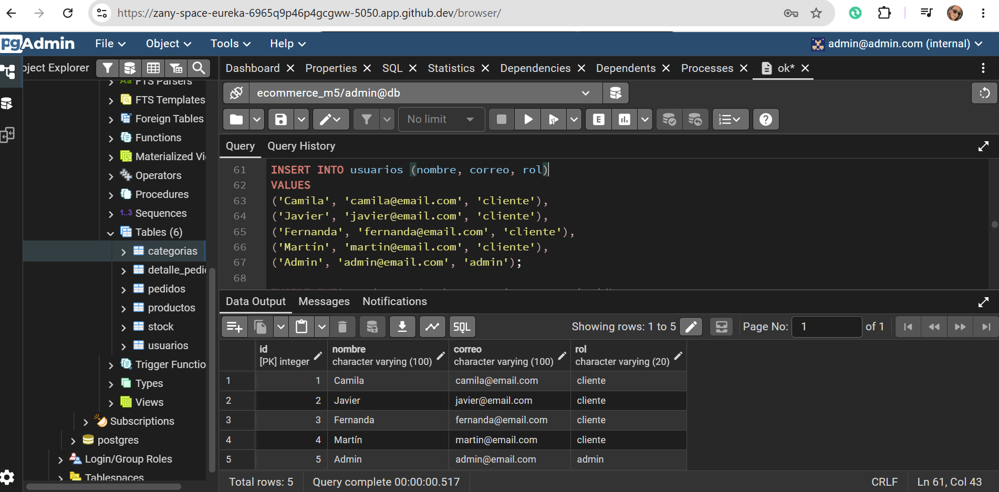
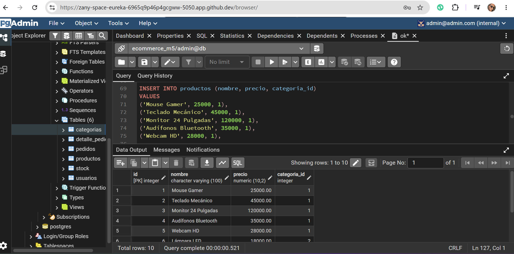
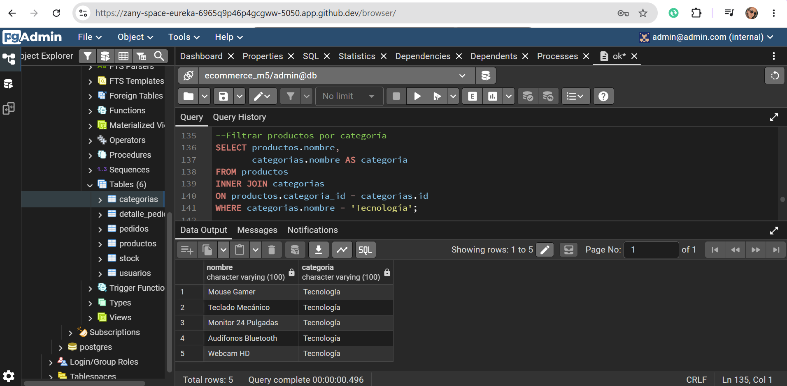
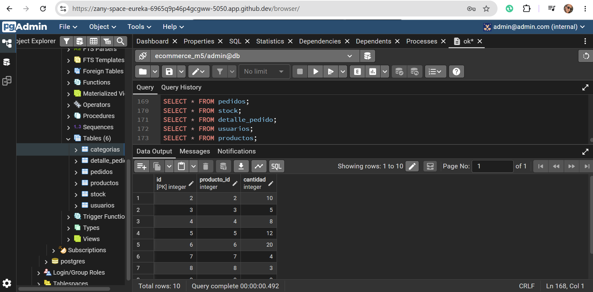

# Proyecto Base de Datos E-Commerce

## Descripción General

Este proyecto consiste en el desarrollo de una base de datos relacional para un sistema de e-commerce utilizando PostgreSQL y Docker.

La base de datos permite gestionar:

- Usuarios
- Categorías de productos
- Productos
- Stock
- Pedidos
- Detalle de pedidos

Además, se implementaron relaciones entre tablas mediante claves primarias y claves foráneas para mantener la integridad de los datos.

---

# Tecnologías Utilizadas

- PostgreSQL
- Docker
- Docker Compose
- SQL
- GitHub

---

# Estructura del Proyecto

```text
ECOMMERCE_M5/
│
├── capturas/
│   ├── queries.png
│   ├── schema.png
│   ├── seed.png
│   └── transaction.png
│
├── docker-compose.yml
├── modelo_er.png
├── queries.sql
├── README.md
├── schema.sql
├── seed.sql
└── transaction.sql
```

---

# Orden de Ejecución de los Scripts

## 1. Levantar el contenedor PostgreSQL

```bash
docker compose up -d
```

---

## 2. Ejecutar script de creación de tablas

```bash
docker exec -i postgres-db psql -U admin -d ecommerce_m5 < schema.sql
```

Este script crea todas las tablas y relaciones de la base de datos.

---

## 3. Ejecutar script de inserción de datos

```bash
docker exec -i postgres-db psql -U admin -d ecommerce_m5 < seed.sql
```

Este script inserta categorías, usuarios, productos, stock y pedidos de prueba.

---

## 4. Ejecutar consultas SQL

```bash
docker exec -i postgres-db psql -U admin -d ecommerce_m5 < queries.sql
```

Este archivo contiene consultas para listar productos, filtrar categorías, calcular pedidos y verificar stock.

---

## 5. Ejecutar transacciones

```bash
docker exec -i postgres-db psql -U admin -d ecommerce_m5 < transaction.sql
```

Este script realiza una transacción de ejemplo utilizando `BEGIN`, `COMMIT` y actualización de stock.

---

# Evidencia de Ejecución

## Creación de tablas



---

## Inserción de datos



---

## Consultas SQL



---

## Transacciones



---

# Relaciones de la Base de Datos

- Un usuario puede tener muchos pedidos.
- Un pedido puede tener muchos productos.
- Un producto pertenece a una categoría.
- Cada producto posee un registro de stock.
- La tabla `detalle_pedido` permite relacionar productos con pedidos.

